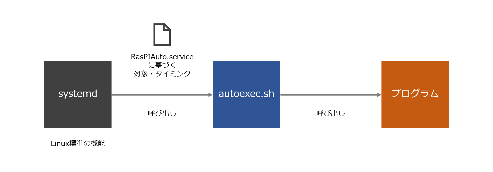

# 起動のメカニズム

## 全体像

事前にRasPIAuto.serviceでsystemdへの指示を記述する。また、autoexec.shにプログラムを呼び出すコマンドを記述する。

電源投入時、systemdはRasPIAuto.serviceに基づいて、指定のタイミング（ストレージの内容のマウントが完了した直後）に指定の対象（今回はautoexec.sh）を実行する。

ロボットの動きを定義するプログラムを実行する。


電源投入時にプログラムを自動実行する一般的な方法があるので、本プロジェクトでもこれを実践した。

1. 開発者はプログラムを作成した後、そのプログラムを実行する.shを作成する。

2. .serviceに、プログラム実行のタイミングと対象（.sh）を定義し、systemdへサービスの実行をお願いする。

3. 次回以降、電源投入直後systemdの働きによって.shが実行される。したがって、プログラムが実行される。

> .shには任意のコマンドが記述できそう（やろうと思えば、プログラム実行だけでなく、いろんなことができる）。
> 
> .serviceは、systemdによって規定されるフォーマットに従う。




## systemd

Linux標準の機能で、初期化（OS起動直後）の呼び出しを実行する。

ただし、その実態はOSのリソース管理全般を担う多機能コンポーネントである。

（Linuxの開発の中で膨れ上がって、後発的に機能が付け足されていったのかも）

systemctlコマンドによって、その機能を引き出すことができる。

例えば、以下のようなコマンドを持つ。

```
systemctl start サービス名
systemctl stop サービス名
systemctl status サービス名
```

見て分かる通り、特定の名前の付いたサービスを指定して指示を出す。

サービスは、/etc/systemd/system配下にサービスファイルを配置することで、systemdの支配下に収まる。

## サービスファイル（・・・.service）

mada

なにこれ

## シェルスクリプト（・・・.sh）

LinuxなどのOSのコマンドラインインターフェース（あの真っ黒な画面！！ターミナル！！）で実行できる一連のコマンドを記述したプログラムファイル。

例えば、

以下のような内容のsample.shを作成保存し、

```
cd /home/mil/work/RasPike-ART/sdk/workspace
make start
```

sample.shのディレクトリで、以下のコマンドを実行したとき、

```
sh sample.sh
```

これは、上の2つのコマンドを実行したのと同義である。

今回のmake startというのは、プログラムを実行するコマンドである。