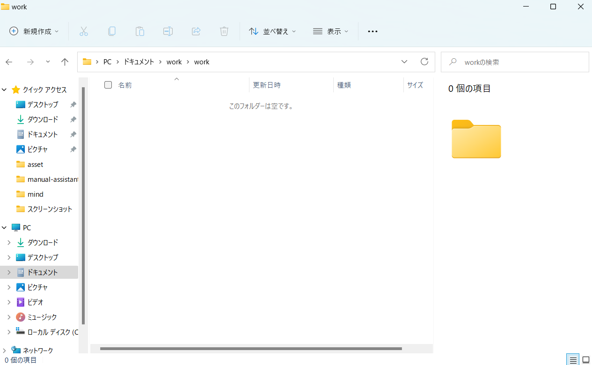
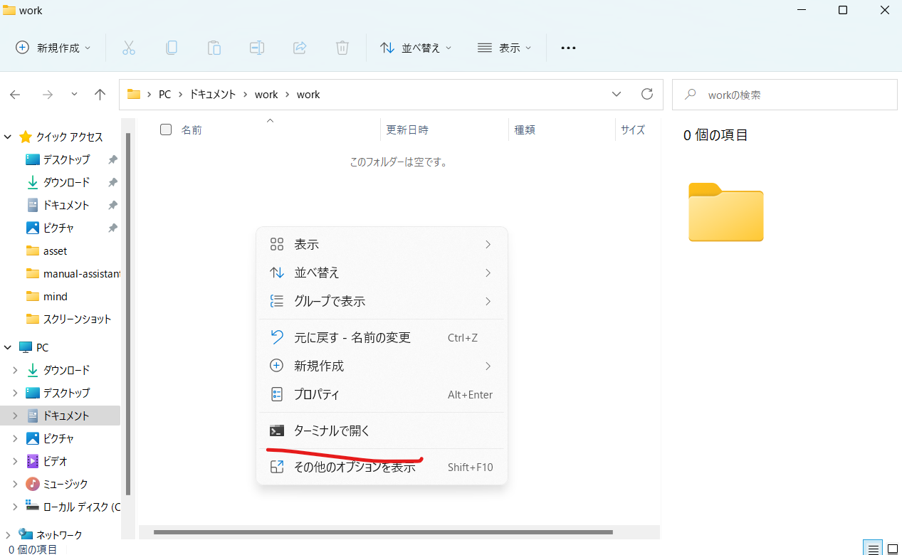
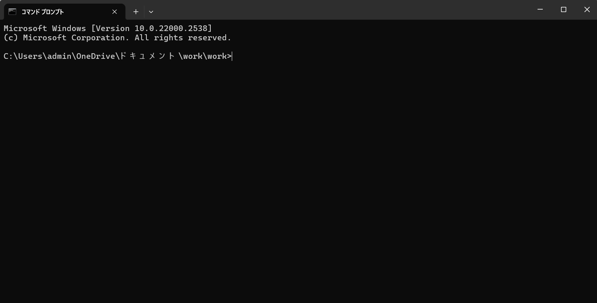
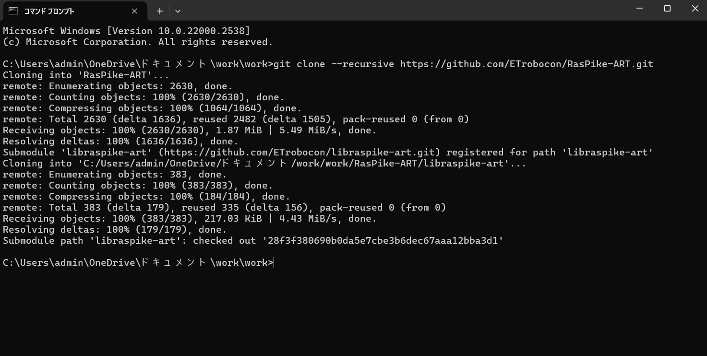
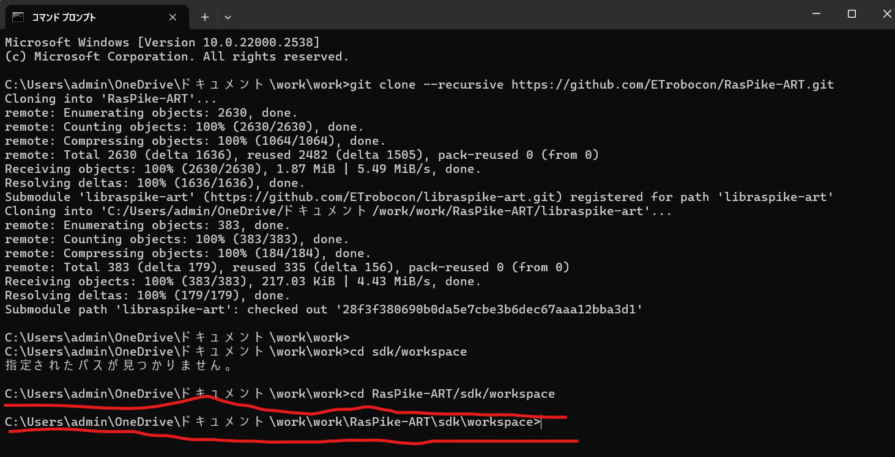
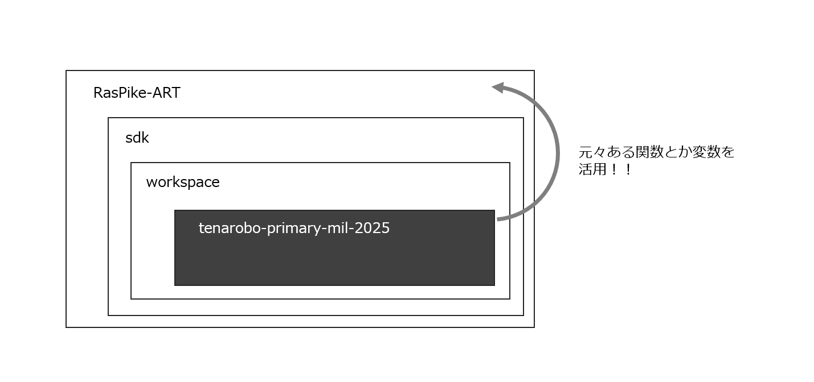

# 開発

本稿では、tenarobo-primary-mil-2025の開発手順を記す。

ここではソースコードを追加・編集・削除する場合の手順を説明する。

> 実際にロボットを動かすとなると、ロボット積載コンピュータ内のファイルを変更しなければならない。そのケースでは[onRasPI.md](./onRasPI.md)を参照すること。

# 最初の1回だけやること

ソースコードを手元に持ってくる。

ソースコードはインターネット上に配置して、誰でも持ってこれるようにしている。

## 0. 準備

- 自分のPC

- インターネット環境（Wi-fiなど）

## 1. エクスプローラで適当なフォルダを開く

そのフォルダの中にソースコードをダウンロードして、以後追加・編集・削除の作業の起点にする。

workなどのフォルダを作って、その中にアクセスしてもよい。



## 2. ターミナルを開く

真っ黒な画面を開く。

エクスプローラの真ん中あたりで右クリックすると、"ターミナルで開く"と出てくる。



それを押すと出てくる。



## 3. RasPike-ARTプロジェクトをダウンロードする

以下のコマンドを入力してEnterを押す。

```
git clone --recursive https://github.com/ETrobocon/RasPike-ART.git
```

以下のように表示されたら成功。



> 失敗した場合、インターネットに接続できていないかもしれない。PCのインターネット設定を確認し、有線ケーブルや Wi-fi でインターネットに接続する。
> 
> もしくはPCにgitがダウンロードされていないのかも。ターミナルに"git --version"と入力してEnterしたときに、"no command"って出たら、あっ。相談してください。

> ここでダウンロードしたのはMILオリジナルではなく、ETロボコン主催者が作成した開発起点である。
> 
> この中にMILのプロジェクトをダウンロードすることで、入れ子の状態にする。これが本開発の構えである。

## 4. RasPike-ARTフォルダ内を移動する

引き続きターミナルにて、以下のコマンドを入力してEnterを押す。

```
cd RasPike-ART/sdk/workspace
```

以下のような雰囲気ならば成功。



## 5. MILオリジナルのプロジェクトをダウンロードする

引き続きターミナルにて、以下のコマンドを入力してEnterを押す。

```
git clone https://github.com/miyoshiyuu-systena/tenarobo-primary-mil-2025
```

以下のような雰囲気ならば成功。表示の数字はプロジェクトの肥大に伴って変わるかもしれないが、100%, doneというのは出るはず。


これでPCの中に開発のためのソースコードが一式導入された！

## 解説

### git cloneコマンド

インターネットからソースコードをダウンロードする。（= 元々外部のコンピュータに存在するソースコードを自分のPCにコピーする。）

コマンドに引き続いてURLを指定する。

このURLをブラウザの検索バーに入力すると、githubのホームページに飛ぶ。これはこれで見やすいので、ただ閲覧するだけならばこれで結構。

### git

ソースコードの更新履歴を保存するソフトウェアである。

変更を巻き戻すことで容易に実装前の状態に戻せるので、開発者にチャレンジする勇気を与える。

### cdコマンド

フォルダ間を移動するコマンド。

### 今回やったこと

3つのコマンドを実行した。

```
git clone --recursive https://github.com/ETrobocon/RasPike-ART.git
```

このコマンドで、RasPike-ARTプロジェクトをダウンロードした。

```
cd RasPike-ART/sdk/workspace
```

このコマンドで、ダウンロードしたRasPike-ARTのsdk/workspaceフォルダにもぐりこんだ。

```
git clone https://github.com/miyoshiyuu-systena/tenarobo-primary-mil-2025
```

このコマンドで、MILオリジナルプロジェクトをダウンロードした。

つまり、プロジェクトの中に内包される形でプロジェクトをダウンロードしたのである。

以下のような構成になっている。



このような関係にすることで、既存のRasPike-ARTの実装を再利用して、MILオリジナルプロジェクトを洗練しやすくする狙い。

# 実装を任されたら・・・

（チケットの説明は別項に譲る。[プロジェクトマネジメント](pj/README.md)）